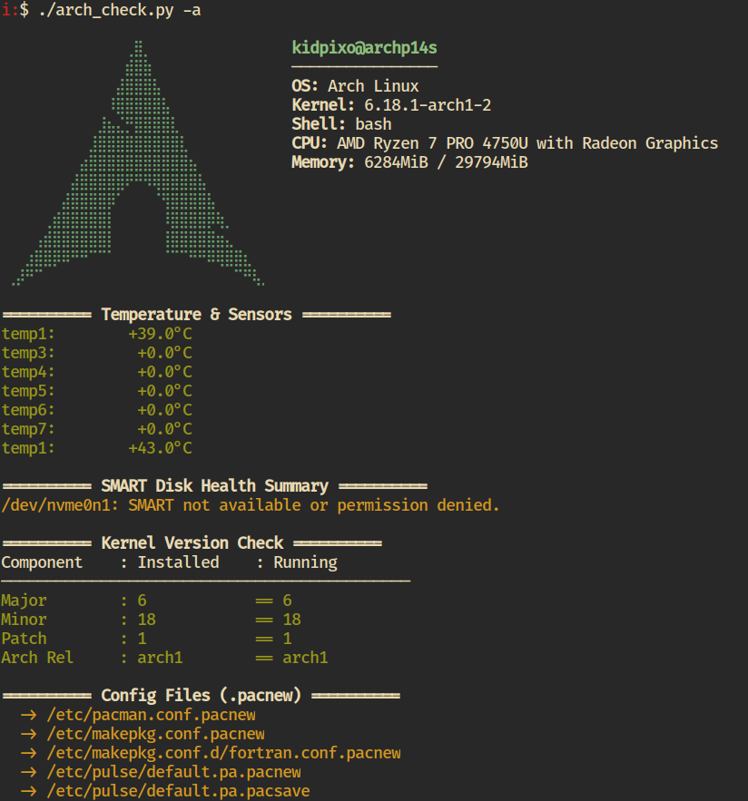

# arch_check

Arch Linux system health and disk origin checker CLI.
Written only with python stdlib, no dependencies. 
It is a glorified cli command glue and frontend.

## Features
- Shows disk usage and device ancestry for all major mounts
- Reports temperature sensors
- Checks SMART disk health
- Kernel, pacnew, failed services, orphaned packages, and more



*Screenshot: arch_check in action*

## Usage

```sh
arch_check -d           # Show disk usage and device origins
arch_check --sensors    # Show temperature sensors
arch_check --smart      # Show SMART disk health
arch_check -a           # Run all checks
arch_check --help       # Show all options
```

## Install (Recommended: pipx)

```sh
pipx install .
```

## Install via PKGBUILD (Arch Linux)

```sh
makepkg -si
```

This will install the CLI as `/usr/bin/arch_check`.

## Requirements
- Python 3.8+
- Arch Linux (for full features)
- lm_sensors, smartmontools, systemd, pacman

## License
MIT
